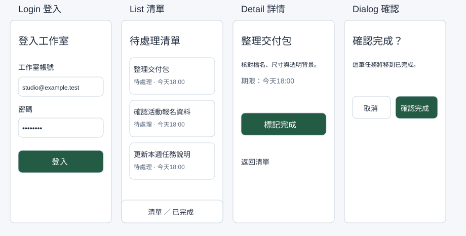

## 內部設計（不進學員頁）

本課新增能力：依用途建立視覺規則，說明對比與非顏色線索，並在長句下檢查閱讀層級。依 `_design/COURSE-BLUEPRINT.md` 的同檔案整合路徑；保留 99h 行政配置，未以真人試跑鎖定分鐘。

| 活動 | 素材／產物 | 操作與決策 | 認知工作／支援 |
|---|---|---|---|
| Demo | 正文提供的完整輸入／方法示範 | 講師建模本課首次方法與可見結果 | 完整理由及步驟 |
| Together | 同一工作室任務清單／學員自己的完成物 | 正文「跟著做」需自行選層、設定與判斷 | 支援遞減，自己定位欄位、解釋檢查結果 |
| Solo | 本課不同條件／修正後完成物 | 正文「自己完成」依新限制選擇方法 | 獨立診斷與遷移，依完成條件判斷 |

素材：正式正文的可複製資料、每課 START-HERE、完成檢查表、共用視覺參考，B7 有 PSD，B8 有下載 ZIP。素材存在／版本由驗證紀錄確認，不以本段自填 PASS。

<!-- learner-content:start -->
# 讓畫面看得清楚：色彩、字型與閱讀順序

你要製作「工作室待處理清單」。先決定標題、內文、按鈕和錯誤訊息怎麼呈現，再用同一套規則完成登入與清單畫面。本堂會留下色彩表、文字樣式表與一張 402×874 手機畫面。

## 開始前，先找到材料與起點

你能開啟瀏覽器、輸入文字、儲存檔案即可開始，不需要會畫圖或寫程式。若不知道 Frame、Layers 或如何選取，先依下一節完成第一個物件。

先開啟[本堂起始材料（HTML）](../../courses/uiux-designer/assets/A1-visual-foundations/START-HERE.html)，讀取輸入與圖層名稱；操作在你的 Figma 檔或本堂指定工具完成。完成後到[本堂完成檢查表（可儲存／下載）](../../courses/uiux-designer/assets/A1-visual-foundations/reference/EXPECTED-CHECK.html)記錄實際結果。

## 第一次用 Figma：建立自己的課程檔

1. 開啟[課前準備與操作速查](../../courses/uiux-designer/assets/COURSE-START.html)，完成登入。這門課用 Figma Design，請建立設計檔，不選 FigJam、Slides 或 Make。
2. 在檔案首頁開啟 Drafts／草稿，選 New design file，將檔名改為「工作室任務清單－你的姓名」。看到畫布、左側 Layers（圖層）、右側 Design（設計）後繼續。
3. 按 F，於空白畫布拖出 Frame（畫板），在右側 W、H 輸入 402、874。左側將它命名為 `Screen / Login`。Frame 是放置畫面內容的容器，Rectangle 只是形狀，不能當作同樣的容器。
4. 按 T，點在 Frame 裡輸入「登入工作室」。按 Esc 結束文字編輯，再以左側 Layers 選取這個文字層。右側要看到字型與字級設定；看不到時先確認選到的是文字，沒有選整張畫板。
5. 用 T 建立內文「登入後檢視待處理的任務。」與提示「請輸入工作室帳號」。暫時分別放在 y120、y168、y240。這裡先學閱讀規則，精準容器排列在第 03 堂完成。

## 先決定每個顏色的工作

「色彩角色」就是一個顏色固定負責一件事。主要按鈕使用綠色，錯誤用紅色並加上文字；避免同一種綠色同時表示警告、成功和一般連結。下表是本課範例，可以沿用，之後再依作品調整。

| 角色 | 色碼 | 使用位置 | 選擇理由 |
|---|---|---|---|
| Primary 主要動作 | `#245B45` | 登入、確認完成按鈕 | 與白字有清楚對比，讓主要動作容易辨認 |
| Text 主要文字 | `#1E293B` | 標題與內文 | 淺底上的深色文字 |
| Muted 次要文字 | `#5F6C80` | 日期、輔助資訊 | 比內文弱，但仍須可讀；不要拿來做更淡的正文 |
| Surface 畫面底色 | `#F5F7FA` | 手機背景 | 與白色卡片分出層次 |
| Card 卡片底色 | `#FFFFFF` | 表單、任務列 | 讓內容聚成一組 |
| Border 邊界 | `#CBD5E1` | 一般卡片邊界 | 補充輪廓；輸入框另用 `#5F6C80`，讓界線更清楚 |
| Error 錯誤 | `#B91C1C` | 欄位錯誤 | 同時寫「帳號格式不正確」，不能只換色 |
| Success 成功 | `#15803D` | 完成訊息 | 搭配「已完成」文字或勾號 |
| Warning 警告 | `#92400E` | 需要注意的提醒 | 搭配具體原因，不能只放黃點 |
| Disabled 停用 | `#E2E8F0` 底、`#5F6C80` 字 | 不能執行的按鈕 | 同時說明尚缺的資料，不只讓按鈕變淡 |

選取物件，在 Design 的 Fill（填色）點色塊，輸入六位色碼。文字也用 Fill 改色。建立數個小色塊，每個旁邊寫角色與色碼，合併放在 `Reference / Visual rules` Frame，後面每堂都從這裡查值。

**對比怎麼判斷？**對比值描述前景與背景亮度的差距；一般文字通常以 4.5:1 為基準，大字以 3:1 為基準。不能只靠「看起來差不多」。本課白字／主要綠底與深字／白底符合一般文字基準，次要灰字應放在白底或本課淺底上；更換任一顏色後要重新檢查。[W3C 對比說明](https://www.w3.org/WAI/WCAG22/Understanding/contrast-minimum.html)提供計算條件。現在用[本課對比檢查器](../../courses/uiux-designer/assets/shared/contrast-checker.html)輸入兩個色碼。白字／主要綠底應約7.90:1；記錄實際比值後再改色。更淡的灰色可能在白底通過、淺灰底卻不算通過，要分別計算。

## 字級、字重與行高一起設定

字型是字的樣子；字級是大小；字重是粗細；行高是每一行佔用的垂直空間。只改字級仍可能讓兩行文字擠在一起。課程以 Noto Sans TC 為例；清單找不到時用系統可用的繁體中文字型（如 PingFang TC／微軟正黑體），並在交付規格記錄實際字型，不要假裝已安裝。

| 用途 | 字級／行高（px） | 字重 | 範例 |
|---|---|---|---|
| 畫面標題 | 24／32 | Bold 700 | 待處理清單 |
| 卡片標題 | 18／28 | Medium 500 | 整理交付包 |
| 內文、欄位、按鈕 | 16／24 | Regular 400；按鈕 Medium 500 | 點選任務檢視詳情 |
| 日期與輔助文字 | 14／22 | Regular 400 | 更新於今天 |

講師先把「登入工作室」設成 24／32／700。你同步選自己的內文，設成 16／24／400，輔助文字設成 14／22／400。字重清單沒有 Medium 時用該字型可取得的粗細，記錄差異。右側 Line height 若是 Auto 或百分比，改成明確 px 值。建立文字樣式的入口通常在 Text 樣式圖示；若找不到，先以規則表完成設定，樣式的儲存不影響本堂核心結果。

## 跟著做：用閱讀任務檢查規則

1. 在手機 Frame 加上白色區塊及主要綠色按鈕形狀，旁邊標示將使用的色碼。此時不驗收按鈕結構，第 03、06 堂會完成真正容器。
2. 在白底建立「帳號格式不正確，請輸入工作室電子郵件。」紅色文字，設為 14／22。文字必須說明問題和修正方向。
3. 把內文改成「登入後，先檢視待處理清單，再選取一筆任務確認內容與期限。」讓文字框寬 354，採文字 Auto height／自動高度。文字應換行而不被裁切。
4. 不看規格表，說出哪一個文字是標題、哪個動作最主要、錯誤發生在哪裡。再核對實際字級、字重與色碼。若只能靠位置猜測，修正層級或文字。
5. 在規則表旁記下兩組前景／背景的對比值、實際字型，以及「用文字補足顏色」的例子。儲存檔案，等右上同步狀態完成再關閉。

**卡住時：**文字設定不見，回 Layers 選 T 圖示的文字層；長句超出畫面，改文字框寬度與文字 Auto height；中文字變成方框，換成支援中文的字型；錯誤只有紅色，補上問題與修正句。先修這些，再把整張畫面截圖。

## 自己完成：改變條件再檢查

把主要綠色改成你選的品牌色，只更換 Primary。檢查白字是否仍可讀；不合基準就改字色或改深背景，寫下取捨。另將一段日期改成「今天 18:00 前完成」的警告，選擇 Warning 色並加上原因。交出規則表及修改前後畫面，不能用縮小字級塞進長句。

## 完成條件與理解檢查

- 色彩表有角色、色碼與用途，錯誤／警告／成功都包含文字線索。
- 文字表有實際字型、字級、行高與字重，手機長句完整可讀。
- 至少記錄主要按鈕與一般內文兩組對比，能說明更換 Primary 後的取捨。

**想一想：**為什麼「錯誤訊息改成紅色」還不夠？

展開參考答案與理由

有些人無法靠顏色分辨狀態，而且紅色本身不會說明原因。需要文字指出哪個欄位出錯、如何修正；顏色是輔助線索。

## 本堂查證來源

- [W3C：一般與大字的對比基準](https://www.w3.org/WAI/WCAG22/Understanding/contrast-minimum.html)
- [Figma：使用文字層](https://help.figma.com/hc/en-us/articles/30938465113751-FD4B-Build-your-bio-using-text-layers)

來源查證：2026-10-09。
<!-- learner-content:end -->

## 講師授課筆記（不進講義）

先用正文入口題檢查前提，再以短示範讓學員同步操作。每次核心狀態改變立即檢查；主要時間用於自行製作、同儕解釋、錯誤修復與新條件作品。先核對學員真實工具權限與檔案；未達完成條件回到本堂修復位置，不以教師代做當成完成。此稿為作者設計與自審，真人理解／遷移與平台實測須另留證據。
