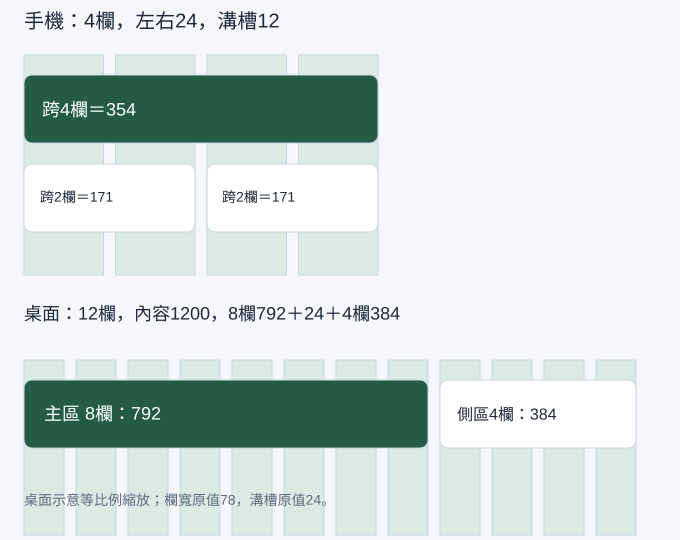

## 內部設計（不進學員頁）

本課新增能力：計算跨欄寬度，從桌面雙區轉成手機閱讀順序。依 `_design/COURSE-BLUEPRINT.md` 的同檔案整合路徑；保留 99h 行政配置，未以真人試跑鎖定分鐘。

| 活動 | 素材／產物 | 操作與決策 | 認知工作／支援 |
|---|---|---|---|
| Demo | 正文提供的完整輸入／方法示範 | 講師建模本課首次方法與可見結果 | 完整理由及步驟 |
| Together | 同一工作室任務清單／學員自己的完成物 | 正文「跟著做」需自行選層、設定與判斷 | 支援遞減，自己定位欄位、解釋檢查結果 |
| Solo | 本課不同條件／修正後完成物 | 正文「自己完成」依新限制選擇方法 | 獨立診斷與遷移，依完成條件判斷 |

素材：正式正文的可複製資料、每課 START-HERE、完成檢查表、共用視覺參考，B7 有 PSD，B8 有下載 ZIP。素材存在／版本由驗證紀錄確認，不以本段自填 PASS。

<!-- learner-content:start -->
# 用格線安排手機與桌面版面

前一堂已決定色彩與文字。本堂用格線讓卡片、欄位和按鈕有共同的左右邊界，完成手機與桌面兩種版面。格線是對齊參考，不會自動排好你的內容。

## 開始前，先找到材料與起點

在第01堂檔案找到 `Screen / Login`，選外層應看到402×874。若只能選到文字，回 Layers 點 Frame 名稱；缺檔時依課前速查重建此空白 Frame，貼上上一堂規則。

先開啟[本堂起始材料（HTML）](../../courses/uiux-designer/assets/A2-grid-layout/START-HERE.html)，讀取輸入與圖層名稱；操作在你的 Figma 檔或本堂指定工具完成。完成後到[本堂完成檢查表（可儲存／下載）](../../courses/uiux-designer/assets/A2-grid-layout/reference/EXPECTED-CHECK.html)記錄實際結果。

## 用欄、溝槽與邊界安排版面

邊界 Margin 是畫面邊緣留白；欄 Column 是可以放內容的直條區域；溝槽 Gutter 是欄與欄之間的空隙。卡片可以跨多欄，不需要把每個字放進一欄。

| 畫面 | 寬度 | 左右邊界 | 欄數 | 溝槽 | 每欄寬度 |
|---|---|---|---|---|---|
| 手機 | 402 | 各 24 | 4 | 12 | `(402−48−36)÷4＝79.5` |
| 桌面 | 1440 | 各 120 | 12 | 24 | `(1440−240−264)÷12＝78` |

手機卡片跨 4 欄，寬度為 354；跨 2 欄時，寬度為 `79.5×2＋12＝171`。桌面跨 8 欄的主內容寬為 `78×8＋24×7＝792`，跨 4 欄的側區為 384，兩區之間留 24，共 1200。這些數字是本課設計起點，實際使用時仍要檢查內容，不是所有網站都必須用相同邊界。

## 示範：手機格線與全寬卡片

1. 選第 01 堂的 `Screen / Login` 外層，確認 W402、H874。在 Design 的 Layout guides／Layout grid 找到新增入口，加入 Columns。若只看到方格 Grid，改成 Columns，不改物件位置。
2. 設 Count 4、Type Stretch、Margin 24、Gutter 12；參考線使用低透明度，文字仍要可讀。格線應左右各留 24，中間分成 4 欄。
3. 按 F 在手機內建立 `Login / Content` Frame，設定 x24、y120、W354。放入標題、帳號標籤與主要動作的視覺材料，左邊都對 x24。暫時用固定高度，下一堂改 Auto Layout。
4. 用 R 畫一張白色參考卡片，x24、W354；再畫兩個 W171 的區塊，x24 及 x207。兩小區塊間應有 12px，不靠目測拉到「差不多」。
5. 開關格線顯示，觀察內容是否仍然對齊。格線只留在設計檔，不當成成品的裝飾背景。

**檢查點：**外層仍是 402，不要把卡片的 354 填到手機 Frame；卡片沒有蓋到左右留白；兩小區塊總寬 `171＋12＋171＝354`。設定看不到時，先在 Layers 選最外層 Frame。選到 Rectangle 不會出現相同的格線設定。

## 跟著做：建立桌面版並判斷跨欄

1. 新建 `Screen / Desktop reference`，W1440、H900，套用桌面 12 欄規格。
2. 在 x120、y120 建立主內容 Frame，W792；在 x936、y120 建立側區 Frame，W384。主內容放待處理清單，側區放「今日提醒」。桌面由兩區分工，手機改成上下排列，不能把桌面直接等比縮小。
3. 把第 01 堂的文字樣式放進兩區。主標題左緣、內文左緣與卡片左緣要有共同參考；卡片內文字可再縮排 16，這個內縮是 padding，第 03 堂會實作。
4. 自己選一項內容決定跨 4、8 或 12 欄，說出原因。例如說明很長的交付清單適合主區，短提醒適合側區。核對內容沒有被切到溝槽。
5. 在規格表記錄手機／桌面兩種數值，截圖保留開啟格線與關閉格線兩種畫面。另記桌面內容轉為手機上下排列的順序。

## 尺寸不對時，先算再修

- 卡片太寬：檢查它的 W，而不是修改整張 Frame。手機的可用寬度是 `402−24×2＝354`。
- 最右側多一個溝槽：N 欄只會有 N−1 個內部溝槽；4 欄用 3 個，12 欄用 11 個。
- 文字對齊外框而顯得擁擠：保留卡片跨欄寬度，將文字向內留 16；內外留白負責不同層次。
- 改畫面寬度後卡片沒有變：格線不是 Auto Layout。先計算新可用寬度；下一堂將子層寬度設為 Fill 才會跟著容器變化。

下一堂沿用 `Screen / Login` 與 `Login / Content`；桌面參考留在同一份檔案，不拿桌面 Frame 取代手機。

## 自己完成：改變條件再檢查

複製手機畫面為 `Screen / Login 360`，改 W360、邊界仍為24、4欄、溝槽12。先算出每欄69、全寬卡片312、兩欄150，再在 Figma 設定並核對。將桌面側區的提醒移到手機主內容下方，說明閱讀順序。通過條件是數值對得上、長句仍可讀，沒有直接縮小文字。

## 完成條件與理解檢查

- 402 與 1440 版面各有正確欄數、邊界、溝槽及跨欄區。
- 能算出並建立手機354／171與桌面792／384的區塊。
- 360版本的卡片312，長內容沒有超出畫面，手機閱讀順序有理由。

**想一想：**402畫面用4欄、邊界24、溝槽12，為什麼可用寬度不是402？

展開參考答案與理由

左右各保留24，因此內容區只有354；其中含4欄及3個溝槽。格線的欄寬是79.5，跨4欄區塊仍是354。

## 本堂查證來源

- [Figma：版面格線／參考線](https://help.figma.com/hc/en-us/articles/360040450513-Create-layout-grids-with-grids-columns-and-rows)

來源查證：2026-10-09。
<!-- learner-content:end -->

## 講師授課筆記（不進講義）

先用正文入口題檢查前提，再以短示範讓學員同步操作。每次核心狀態改變立即檢查；主要時間用於自行製作、同儕解釋、錯誤修復與新條件作品。先核對學員真實工具權限與檔案；未達完成條件回到本堂修復位置，不以教師代做當成完成。此稿為作者設計與自審，真人理解／遷移與平台實測須另留證據。
