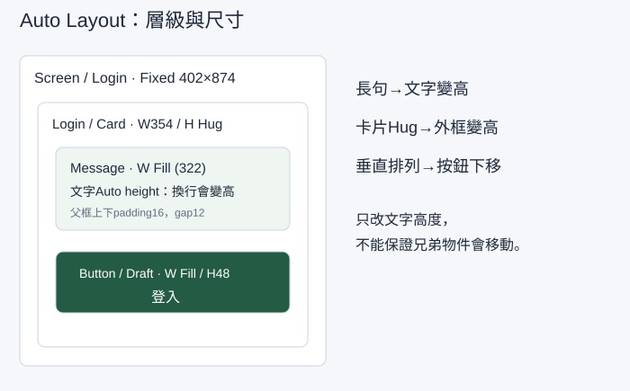

## 內部設計（不進學員頁）

本課新增能力：建立真正的Auto Layout階層，以文字／容器不同尺寸模式處理長句、增刪與寬度變化。依 `_design/COURSE-BLUEPRINT.md` 的同檔案整合路徑；保留 99h 行政配置，未以真人試跑鎖定分鐘。

| 活動 | 素材／產物 | 操作與決策 | 認知工作／支援 |
|---|---|---|---|
| Demo | 正文提供的完整輸入／方法示範 | 講師建模本課首次方法與可見結果 | 完整理由及步驟 |
| Together | 同一工作室任務清單／學員自己的完成物 | 正文「跟著做」需自行選層、設定與判斷 | 支援遞減，自己定位欄位、解釋檢查結果 |
| Solo | 本課不同條件／修正後完成物 | 正文「自己完成」依新限制選擇方法 | 獨立診斷與遷移，依完成條件判斷 |

素材：正式正文的可複製資料、每課 START-HERE、完成檢查表、共用視覺參考，B7 有 PSD，B8 有下載 ZIP。素材存在／版本由驗證紀錄確認，不以本段自填 PASS。

<!-- learner-content:start -->
# 讓文字變長時，容器與按鈕一起排好

登入提示一變長，按鈕就被擋住。本堂會真正建立 Auto Layout 容器：讓文字換行、容器增高、按鈕往下移。你還會增刪子層及改畫面寬度，確認版面能跟著內容調整。

## 開始前，先找到材料與起點

在第02堂手機版找到402畫面與354內容區。能說出354＝402−左右24即可開始。缺檔時依本堂示範重建402Frame；本堂會建立全部必要子層，不依賴不存在的按鈕。

先開啟[本堂起始材料（HTML）](../../courses/uiux-designer/assets/A3-auto-layout-pressure/START-HERE.html)，讀取輸入與圖層名稱；操作在你的 Figma 檔或本堂指定工具完成。完成後到[本堂完成檢查表（可儲存／下載）](../../courses/uiux-designer/assets/A3-auto-layout-pressure/reference/EXPECTED-CHECK.html)記錄實際結果。

## 文字高度與容器高度是兩個設定

文字的 **Auto height** 是文字框隨行數變高；Auto Layout Frame 的 **Hug contents** 是外框包住子層與留白。兩者作用在不同層。只有文字變高，下一個按鈕不一定移動；要把文字和按鈕放在同一個垂直 Auto Layout 裡。

| 設定 | 設在哪裡 | 本例效果 |
|---|---|---|
| Vertical 垂直排列 | 父 Auto Layout Frame | 子層由上到下排列 |
| Padding 內距 | 父容器 | 邊界到內容留16 |
| Gap 間距 | 父容器 | 文字與按鈕之間留12 |
| Fixed 固定尺寸 | 402手機Frame、354卡片寬度 | 明確控制畫面或容器寬 |
| Hug contents 包住內容 | 卡片高度 | 文字變高後，卡片變高 |
| Fill container 填滿容器 | 卡片內文字與按鈕寬度 | 使用父容器扣除內距的322 |
| Auto height 自動高度 | 文字層的文字尺寸模式 | 行數增加時文字框變高 |

父容器寬度已知，子層才能填滿它。不要在同一軸把父設為 Hug 又要求子 Fill，造成互相等待。這堂卡片寬固定、卡片高 Hug；文字寬 Fill、文字高 Auto height。

## 示範：先建立按鈕，再把兩個子層包進卡片

1. 在 `Screen / Login` 內按 T，輸入「登入工作室」，套用24／32的標題。暫放上方，先完成下方卡片。
2. 按 T 建立 `Message`，文字為「請輸入工作室帳號」，設16／24。將文字模式改為 Auto height，先給它 W322。
3. 另建文字 `Label`，內容「登入」。選這個文字層按 Shift+A，Figma會新增包住文字的 Auto Layout Frame。命名 `Button / Draft`，改水平排列、對齊中央、水平內距16、垂直內距12。文字行高24，所以按鈕高度應為48。填主要綠色，文字改白色。此時它是練習按鈕，第04堂轉主元件。
4. 在 Layers 同時選 `Message` 與 `Button / Draft` 兩個同層物件，再按 Shift+A。命名新外框 `Login / Card`，選 Vertical，Gap12、四邊Padding16、W354、Height Hug contents，填白色。
5. 將卡片置於手機x24、y200。選卡片內的 Message，把寬度設為 Fill container，文字高度維持 Auto height；選按鈕外框，把寬度設為 Fill、H48。按鈕文字維持置中。
6. 檢查 Layers：`Screen / Login` → `Login / Card` → `Message`、`Button / Draft` → `Label`。兩個子層要在同一卡片內，不只是畫布上看起來相鄰。
7. 把 Message 改成「密碼至少需要包含一個英文大寫字母與一個數字」。它應增加行數，卡片Hug跟著增高，按鈕被往下推，間距仍12。按鈕與卡片寬度不變。

短句一行24高時，卡片預期高度是 `16＋24＋12＋48＋16＝116`；長句兩行48高時是140。實際行數依字型而變，請用當時文字高度代入，不把140當成所有字型的固定答案。

**檢查點：**在Layers選外框，右側出現Auto Layout設定；改句子後按鈕真的移動；Message寬322；卡片底部仍留16。缺一項時先修，不靠手動拖按鈕保留漂亮截圖。

## 跟著做：不看示範數值，判斷設定位置

1. 把錯誤句改為「帳號格式不正確，請輸入工作室電子郵件。」你要先判斷改的是文字、卡片，還是手機Frame，再開始。
2. 在Message和按鈕之間新增14／22輔助文字 `Hint`：「範例：studio@example.test」。把它拖進卡片的Layers子層，檢查順序Message→Hint→Button。卡片應增加Hint高度與一個Gap，不覆蓋按鈕。
3. 刪除Hint，卡片應回到原先高度；Undo還原後再看一次。這是內容增刪的測試，不是新增第二張相同畫面。
4. 將卡片寬改為312，Message應成為280，因為四邊Padding仍16。不要手動把Message改成280；Fill會使用父容器的剩餘寬度。
5. 複製卡片做窄文字測試：將Message寬改為Fixed200，觀察文字換行。這次只有文字框較窄，卡片仍312。記錄Fixed與Fill的差別，再把主線卡片還原為354、Message Fill。

## 常見現象與回修位置

| 現象 | 檢查位置 | 修好後要看到 |
|---|---|---|
| 長句不換行 | Message寬度與文字尺寸模式 | 寬度受限、Auto height增加行數 |
| 字變高、按鈕不動 | Login / Card的Auto Layout與子層 | 垂直排列、兩物件是同一父層的子層 |
| 卡片裁掉下方按鈕 | 卡片Height | Hug contents，底部留16 |
| 新增Hint沒改高度 | Hint層級／Ignore auto layout | 位於卡片內、未忽略Auto Layout |
| 找不到Fill選項 | 所選物件與父層 | 子層必須在Auto Layout父框裡；手機外層不選Fill |
| 按鈕文字偏左 | Button / Draft對齊 | 水平與垂直皆置中，不靠空白字元 |

下一堂把 `Button / Draft` 轉為主元件；卡片保留作為後續表單容器。

## 自己完成：改變條件再檢查

複製手機為360版本，卡片W312；新增兩個提示層後，自己決定排列順序。故意把卡片高設Fixed100，截下裁切，再修回Hug。交出402與360兩種畫面、增刪後的高度、一次錯誤修復，並說明為何只改文字Auto height不能推開按鈕。

## 完成條件與理解檢查

- 卡片真的有Vertical、Padding16、Gap12、W354／Height Hug設定。
- 文字Auto height與卡片Hug分開，Message和Button都在卡片裡。
- 長句、子層增刪與360畫面都不重疊；能復原故意固定高度的錯誤。

**想一想：**你選到Message，為什麼看不到卡片的Hug contents？

展開參考答案與理由

Message是文字層，應設定文字Auto height；Hug要在包住它的Auto Layout Frame上設定。文字變高後，父框Hug配合垂直排列才會把後面的按鈕往下推。

## 本堂查證來源

- [Figma：Auto Layout、尺寸與間距](https://help.figma.com/hc/en-us/articles/360040451373-Guide-to-auto-layout-in-Figma)
- [Figma：文字層尺寸](https://help.figma.com/hc/en-us/articles/30938465113751-FD4B-Build-your-bio-using-text-layers)

來源查證：2026-10-09。
<!-- learner-content:end -->

## 講師授課筆記（不進講義）

先用正文入口題檢查前提，再以短示範讓學員同步操作。每次核心狀態改變立即檢查；主要時間用於自行製作、同儕解釋、錯誤修復與新條件作品。先核對學員真實工具權限與檔案；未達完成條件回到本堂修復位置，不以教師代做當成完成。此稿為作者設計與自審，真人理解／遷移與平台實測須另留證據。
