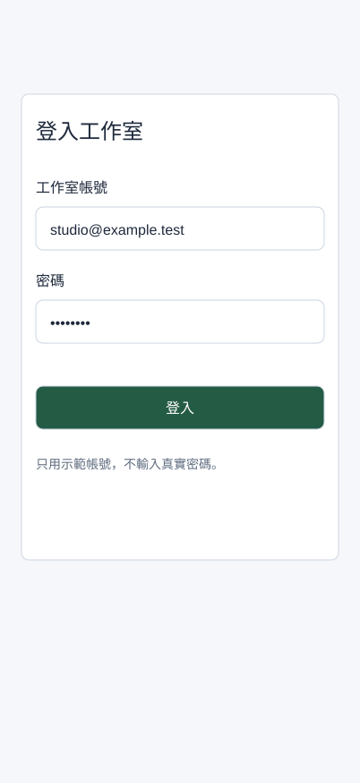

## 內部設計（不進學員頁）

本課新增能力：組成多欄表單，分辨正常／錯誤／修正狀態，以Auto Layout處理長提示。依 `_design/COURSE-BLUEPRINT.md` 的同檔案整合路徑；保留 99h 行政配置，未以真人試跑鎖定分鐘。

| 活動 | 素材／產物 | 操作與決策 | 認知工作／支援 |
|---|---|---|---|
| Demo | 正文提供的完整輸入／方法示範 | 講師建模本課首次方法與可見結果 | 完整理由及步驟 |
| Together | 同一工作室任務清單／學員自己的完成物 | 正文「跟著做」需自行選層、設定與判斷 | 支援遞減，自己定位欄位、解釋檢查結果 |
| Solo | 本課不同條件／修正後完成物 | 正文「自己完成」依新限制選擇方法 | 獨立診斷與遷移，依完成條件判斷 |

素材：正式正文的可複製資料、每課 START-HERE、完成檢查表、共用視覺參考，B7 有 PSD，B8 有下載 ZIP。素材存在／版本由驗證紀錄確認，不以本段自填 PASS。

<!-- learner-content:start -->
# 完成兩個欄位的登入表單與錯誤修正

現在把按鈕放進能讀懂、能修正的表單。你會建立帳號與密碼兩個欄位，各有標籤、輸入區、提示或錯誤，完成正常、錯誤、修正後三張畫面。這堂設計外觀與狀態，第10堂才連互動。

## 開始前，先找到材料與起點

先從Assets插入Button，確認能選Primary／Default並改Label。做不到時回第05堂；若缺手機Frame，用F新建402×874。下面會完整建立Field與Login / Content。

先開啟[本堂起始材料（HTML）](../../courses/uiux-designer/assets/A6-button-form/START-HERE.html)，讀取輸入與圖層名稱；操作在你的 Figma 檔或本堂指定工具完成。完成後到[本堂完成檢查表（可儲存／下載）](../../courses/uiux-designer/assets/A6-button-form/reference/EXPECTED-CHECK.html)記錄實際結果。

## 一個欄位不只是Rectangle

欄位至少要讓人知道「要填什麼」及「填錯怎麼改」。Label是固定標籤；Input是輸入區；Helper是提示或錯誤。Placeholder只是輸入區內的示意，不能取代Label，因為輸入後會消失。

| 欄位 | 正常內容 | 錯誤內容 | 修正後內容 |
|---|---|---|---|
| 帳號 | Label「工作室帳號」、值 `studio@example.test`、提示「請使用工作室電子郵件」 | 值 `studio`、錯誤「帳號格式不正確，請輸入完整電子郵件」 | 改為 `studio@example.test`，移除錯誤、恢復提示 |
| 密碼 | Label「密碼」、示意 `••••••••`、提示「至少8個字元」 | 示意 `•••`、錯誤「密碼不足8個字元」 | 示意 `••••••••`，恢復提示 |
| 登入按鈕 | Primary／Default | 仍可選Default讓人再次提交；示範未填齊另用Disabled | Primary／Default |

本課所有資料均為示範，不在Figma輸入真實密碼。Figma這些文字層不是可輸入的正式登入系統，無須假裝正在驗證帳密。

## 示範：建立第一個完整欄位

1. 在 `Screen / Login` 保留手機402×874及標題。建立 `Login / Content` 垂直Auto Layout，x24、y120、W354、Hug高、Gap20、無額外內距；放入標題「登入工作室」。舊的卡片測試移到手機外的Reference區，保留作比較。
2. 建文字 `Field / Label`，內容「工作室帳號」，16／24；另建文字 `Field / Value`，內容 `studio@example.test`，16／24。
3. 選Value按Shift+A，命名新框 `Field / Input`，水平內距16、垂直12、W354、H48、白底、1px `#5F6C80`外框、圓角8。Value寬Fill，文字保持單行示意。
4. 建文字 `Field / Helper`，內容「請使用工作室電子郵件」，14／22，寬354、Auto height、次要灰色。
5. 同時選Label、Input、Helper，按Shift+A命名 `Field / Account`，Vertical、Gap8、W354、Hug高。其子層寬都設Fill；Label與Helper文字Auto height。
6. 將Field / Account放進Login / Content。短提示時欄位高度應為 `24＋8＋48＋8＋22＝110`；錯誤換成兩行時Helper高44，整個欄位會增加22，後面的密碼與按鈕往下排。

## 跟著做：第二個欄位與真正的按鈕

1. 複製Field / Account為 `Field / Password`，改Label「密碼」、Value `••••••••`、Helper「至少8個字元」。不照抄帳號提示，要判斷三個子層各自用途。
2. 將Password排到Account下方。從Assets插入Button，Hierarchy Primary、State Default、Label「登入」，命名Instance `Button / Login`，W Fill、H48，放在Login / Content最後。
3. 因為Login / Content有4個子項（標題、Account、Password、Button），Gap20應只出現3次。檢查長Helper不會擋住密碼欄或按鈕。
4. 複製整張手機為 `Screen / Login Error`。依表格修改兩個Value／Helper，Input外框改Error紅，Helper改紅色。保持外框尺寸，不把一整張表單全部變紅。
5. 再複製Error為 `Screen / Login Corrected`，把值改正、恢復一般外框與提示。來源畫面仍是正常／錯誤／修正後三張，不要覆蓋掉Error而失去比較。
6. 建一張 `Screen / Login Empty`練習版，帳號／密碼放示意Placeholder，Button選Disabled，附近加「請先填寫帳號與密碼」。實際元件停用與提示原因需同時出現。

## 檢查表單時，看四個地方

先看Label是否保留；再看Value是否與欄位對應；接著看Helper能否指出問題及修正；最後看主按鈕是否可辨認。正常、Error與Corrected三版的閱讀順序都應為標題→帳號→密碼→登入。

**修復路徑：**如果長錯誤被裁切，先選Helper設文字Auto height／W Fill，再選Field外框Hug，再確認Login / Content為Vertical／Hug。若按鈕仍沒往下移，檢查它是否在同一Auto Layout裡。若手機高度不夠，先記錄內容超出的位置，保留正常字級；第13堂學滾動，不把字縮到10px硬塞。

下一堂新建List畫面與任務列。這堂只需要前堂Button family與本堂新建Field，不依賴尚未存在的List Top。

## 自己完成：改變條件再檢查

將帳號提示換成「請使用公司核發的完整電子郵件，若沒有帳號請先聯絡行政人員」，再把手機改360、Login / Content改W312。兩欄與按鈕寬Fill，長Helper應換行並推開後續內容。另挑一個欄位寫更有幫助的錯誤句。交出三個狀態與360版，說明哪個層決定每次高度變化。

## 完成條件與理解檢查

- 正常／錯誤／修正後三張畫面有帳號與密碼兩欄，Label、Input、Helper齊全。
- Button / Login來自Button元件，Label置中，Default與Disabled皆有文字與明確外觀。
- 長提示與360寬度下，欄位與按鈕不重疊；錯誤句有原因與修正方向。

**想一想：**錯誤版將Placeholder改成紅字，卻沒有固定Label與Helper，為什麼不夠？

展開參考答案與理由

使用者仍可能不知道欄位的正式名稱、出錯原因及修正方式。固定Label讓身分清楚，Helper提供具體回饋；顏色只輔助辨認。

## 本堂查證來源

- [W3C：標籤與說明](https://www.w3.org/WAI/WCAG22/Understanding/labels-or-instructions.html)
- [W3C：錯誤辨識](https://www.w3.org/WAI/WCAG22/Understanding/error-identification.html)
- [Figma：Auto Layout](https://help.figma.com/hc/en-us/articles/360040451373-Guide-to-auto-layout-in-Figma)

來源查證：2026-10-09。
<!-- learner-content:end -->

## 講師授課筆記（不進講義）

先用正文入口題檢查前提，再以短示範讓學員同步操作。每次核心狀態改變立即檢查；主要時間用於自行製作、同儕解釋、錯誤修復與新條件作品。先核對學員真實工具權限與檔案；未達完成條件回到本堂修復位置，不以教師代做當成完成。此稿為作者設計與自審，真人理解／遷移與平台實測須另留證據。
