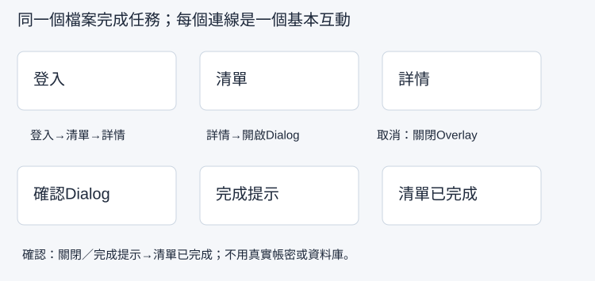

## 內部設計（不進學員頁）

本課新增能力：從任務規劃低細節線框，對映到真實元件與一致命名，指定Prototype入口。依 `_design/COURSE-BLUEPRINT.md` 的同檔案整合路徑；保留 99h 行政配置，未以真人試跑鎖定分鐘。

| 活動 | 素材／產物 | 操作與決策 | 認知工作／支援 |
|---|---|---|---|
| Demo | 正文提供的完整輸入／方法示範 | 講師建模本課首次方法與可見結果 | 完整理由及步驟 |
| Together | 同一工作室任務清單／學員自己的完成物 | 正文「跟著做」需自行選層、設定與判斷 | 支援遞減，自己定位欄位、解釋檢查結果 |
| Solo | 本課不同條件／修正後完成物 | 正文「自己完成」依新限制選擇方法 | 獨立診斷與遷移，依完成條件判斷 |

素材：正式正文的可複製資料、每課 START-HERE、完成檢查表、共用視覺參考，B7 有 PSD，B8 有下載 ZIP。素材存在／版本由驗證紀錄確認，不以本段自填 PASS。

<!-- learner-content:start -->
# 把需求畫成線框，再組成可測試的流程

需求是：「行政人員登入後，找到待處理任務，檢視內容並標記完成。」你會先用線框檢查資訊位置，再放入前八堂的實際元件，建立固定原型入口。線框先決定內容與順序，原型再加上操作行為。

## 開始前，先找到材料與起點

從第08堂檔案找出Login、List、Detail、List Done和Confirm。任意說出一個畫面的進出條件即可開始。缺畫面先依本堂對照回前課重建，不用空白佔位畫面直接接線。

先開啟[本堂起始材料（HTML）](../../courses/uiux-designer/assets/B1-wireframe-prototype-entry/START-HERE.html)，讀取輸入與圖層名稱；操作在你的 Figma 檔或本堂指定工具完成。完成後到[本堂完成檢查表（可儲存／下載）](../../courses/uiux-designer/assets/B1-wireframe-prototype-entry/reference/EXPECTED-CHECK.html)記錄實際結果。

## 先寫任務，讓每張畫面都有理由

任務卡不用寫得像規格檔案，四句話即可：「誰在用、從哪裡開始、要完成什麼、有哪些限制」。本例是：行政人員／Login起點／完成T01任務／手機402，使用示範帳號，不接資料庫。

| 畫面名稱 | 要看到什麼 | 怎麼進入 | 怎麼離開 |
|---|---|---|---|
| `Screen / Login` | 帳號、密碼、登入Button | 原型起始點 | 登入到List |
| `Screen / List` | 三筆任務、Navigation | Login | T01到Detail |
| `Screen / Detail` | T01內容、期限、完成Button | List的T01 | 返回List或開Confirm |
| `Overlay / Confirm` | 結果說明、取消／確認 | Detail的Complete | 取消關閉；確認到List Done |
| `Screen / List Done` | T01已完成、成功Toast | Confirm | 返回待處理或檢視其他專案 |

`Screen / Login Error`與`Screen / List Empty`是額外狀態，不代表所有狀態都需要放進主線。長列表是第13堂增加的滾動版本。把主線與測試分支分清楚，方便找出失敗的那一步。

## 示範：做低細節線框，不先追求漂亮

1. 在同一份Figma檔的空白區新建 `Wireframe / Login`與 `Wireframe / List`，皆402×874。可以先複製空白手機Frame，但不要把整個精緻表單當線框，否則看不出資訊決策。
2. Login只放灰色區塊、固定標籤「帳號」「密碼」與「登入」動作；每個欄位高度48，左右24。List只放「待處理清單」、三列任務區與底部Navigation。
3. 把任務卡放在兩張線框旁，畫箭頭表示Login→List。自己依任務卡走讀：從Login的帳號／密碼欄找到「登入」，沿箭頭到List，再找第一筆T01標題與詳情動作。記錄「起點→動作標籤→下一張畫面→T01位置」，缺一步就補標籤或調整位置。有同學時可先請他只看線框做同樣走讀，保留他的實際路徑，不口頭補充。
4. 修正沒有動詞的按鈕、看不出順序的列表，或過多同樣突出的標題。線框用於找到這些問題，不用先調整陰影或品牌色。

**中間結果：**本人走讀紀錄能逐一對到線框上的登入欄位、登入動作與T01位置，缺漏已修正，這時才進到精緻介面。有同學的閱讀結果另記；沒有同學時標「他人反饋待補」，本人核對不能證明新使用者已理解。線框上的箭頭只是設計說明，還不是Prototype連線。

## 跟著做：把前課元件對回主線畫面

1. 回正式 `Screen / Login`，確認使用 `Field / Account`、`Field / Password`、`Button / Login`；找不到時回第06堂末段重建。主線按鈕名稱統一用Button / Login，不另造Button / Primary或只有「登入」文字的熱區。
2. 回 `Screen / List`，確認 `List / Content`內有Row / T01、T02、T03與Nav / Bottom；Detail包含Button / Complete。Overlay / Confirm在外部畫布，不能直接放進Detail當靜態背景。
3. 按上表逐一寫進畫面清單。每列畫面名稱都要在Layers找得到；若名稱不同，現在統一，下一堂不靠猜Destination。
4. 選最外層Screen / Login，切右側Prototype，新增Flow starting point／流程起始點，命名 `TASK-01 Complete a task`。如果入口在頂端播放圖示旁，確認所選仍是Login，不是它的Button子層。
5. 使用Present／播放預覽。此時只驗收首畫面是Login且尺寸正確；沒有連線時按登入不切頁是正常，下一堂才設定。
6. 在任務卡記錄起點、目標與畫面名字，儲存線框、正式畫面與Preview首畫面。別用另一個獨立Figma檔切斷前課材料。

## 從工具看見錯誤時

- Preview從List開始：在Prototype檢查起始點是不是設到List，移回Login或在預覽選TASK-01。
- 看得到箭頭卻不能點：線框手畫箭頭只表達概念，Prototype需要真正連線。
- Frame名字相同難找：將Login／List／Detail／List Done命名唯一，保留功能詞，不只叫Frame 1。
- 正式畫面與線框內容不同：回任務卡判斷是否合理改動，補理由；不因為線框先畫就永遠不能調整。
- 想找共享Starter檔：本課主線在自己的課程檔完成，起始材料是文字／SVG與重建方法，不需要虛構外部檔案。

下一堂會接Login→List→Detail→返回的基本互動；Confirm與完成結果第12堂加入。

## 自己完成：改變條件再檢查

將使用者換成「第一次使用的工讀生」，目標改為找到T02的期限。做一張Detail線框，並在現有T01詳情旁建立 `Screen / Detail T02`：標題、期限、說明都改為T02。自己從Login線框沿任務路徑定位T02，再在Detail線框找到期限，將找到的位置與第07堂資料表核對。記錄走讀路徑與核對結果；若發現缺標籤、走錯筆或期限不符，保留修改前後，沒有發現問題就照實記「未發現缺漏」。有同學時另外記錄他只看線框的實際路徑與誤解。最後確認原TASK-01入口沒有被這個測試分支覆蓋。

## 完成條件與理解檢查

- 任務卡與五個主線畫面名稱對得上，畫面內容使用前課元件。
- 線框呈現資訊與動作位置，並留下本人走讀紀錄；他人閱讀反饋另記實際結果或待補。
- TASK-01起點在Login，Preview首畫面正確；T02分支有自己的內容。

**想一想：**線框上的箭頭和Prototype連線有何不同？

展開參考答案與理由

線框箭頭說明預期順序，不能執行點選；Prototype連線要繫結實際物件、觸發與目的地，才會在預覽改變畫面。

## 本堂查證來源

- [Figma：連線原型](https://help.figma.com/hc/en-us/articles/360040315773-Connect-your-prototype)

來源查證：2026-10-09。
<!-- learner-content:end -->

## 講師授課筆記（不進講義）

先用正文入口題檢查前提，再以短示範讓學員同步操作。每次核心狀態改變立即檢查；主要時間用於自行製作、同儕解釋、錯誤修復與新條件作品。先核對學員真實工具權限與檔案；未達完成條件回到本堂修復位置，不以教師代做當成完成。此稿為作者設計與自審，真人理解／遷移與平台實測須另留證據。
